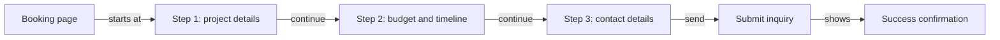

# automated-pr

A Next.js project bootstrapped with [`create-next-app`](https://nextjs.org/docs/app/api-reference/cli/create-next-app).

---

## Latest Update

### Feature: Add App Booking Page

A new multi-step project booking page has been added at the `/booking` route. This page includes:

- A three-step booking form to collect:
  - Project details (services)
  - Budget and timeline
  - Contact details
- Progress bar and draft-save timestamp
- Inquiry summary before submission
- Submission loading state and success confirmation

This enhancement improves the user experience with a guided form flow and feedback on submission.

For details, see [PR #6](https://github.com/rully-saputra15/demo-ai-pr/pull/6) by @rully-saputra15.



---

## Getting Started

Run the development server:

```bash
npm run dev
# or
yarn dev
# or
pnpm dev
# or
bun dev
```

Open [http://localhost:3000](http://localhost:3000) in your browser.

Edit pages under the `app/` directory, including the new `/booking` page at `app/booking/page.tsx`. The app supports hot reloading.

---

## Available Scripts

- `dev`: Start the Next.js development server (`next dev`).
- `build`: Build the application for production (`next build`).
- `start`: Run the built application in production mode (`next start`).
- `lint`: Run ESLint for code quality checks (`eslint`).
- `docs:update`: Update README documentation using AI assistance (`node scripts/update-readme-with-chatgpt.mjs`).

---

## Technologies Used

- [Next.js v16.2.4](https://nextjs.org)
- React 19.2.4
- Tailwind CSS for styling
- TypeScript
- ESLint with Next.js configuration

---

## Learn More

- [Next.js Documentation](https://nextjs.org/docs)
- [Learn Next.js](https://nextjs.org/learn)
- [Tailwind CSS](https://tailwindcss.com)

---

## Deployment

Deploy easily with the [Vercel platform](https://vercel.com/new?utm_medium=default-template&filter=next.js&utm_source=create-next-app&utm_campaign=create-next-app-readme).

See [Next.js Deployment Documentation](https://nextjs.org/docs/app/building-your-application/deploying) for details.
