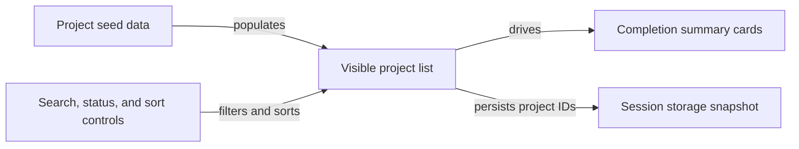

# automated-pr

A Next.js project bootstrapped with [`create-next-app`](https://nextjs.org/docs/app/api-reference/cli/create-next-app).

---

## Latest Update

### Feature: Add New Page 3 Dashboard

A new client-side project dashboard route has been added at `/page2` with these features:

- Seeded project data with typed status and sort models
- Search, status filtering, and sorting controls
- KPI cards showing completion metrics and report links
- Session storage persistence of visible project snapshots on visibility changes

For full details, see [PR #7](https://github.com/rully-saputra15/demo-ai-pr/pull/7) by @rully-saputra15.



---

## Getting Started

Start the development server:

```bash
npm run dev
# or
yarn dev
# or
pnpm dev
# or
bun dev
```

Open [http://localhost:3000](http://localhost:3000) in your browser.

Edit files under the `app/` directory to modify pages or add new ones, such as `app/page2/page.tsx` for the new dashboard. The app supports hot reloading.

---

## Available Scripts

- `dev` - Start Next.js development server (`next dev`)
- `build` - Build the production app (`next build`)
- `start` - Run the production app (`next start`)
- `lint` - Run ESLint (`eslint`)
- `docs:update` - Update README via AI-assisted script (`node scripts/update-readme-with-chatgpt.mjs`)

---

## Technologies Used

- [Next.js v16.2.4](https://nextjs.org)
- React 19.2.4
- Tailwind CSS for styling
- TypeScript for static typing
- ESLint with Next.js configuration

---

## Learn More

- [Next.js Documentation](https://nextjs.org/docs)
- [Learn Next.js](https://nextjs.org/learn)
- [Tailwind CSS](https://tailwindcss.com)

---

## Deployment

Deploy easily with [Vercel](https://vercel.com/new?utm_medium=default-template&filter=next.js&utm_source=create-next-app&utm_campaign=create-next-app-readme) or follow the [Next.js deployment guide](https://nextjs.org/docs/app/building-your-application/deploying).

---
