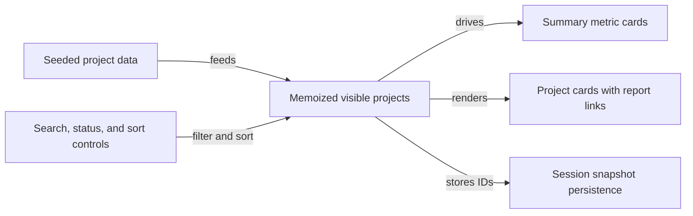

# automated-pr

This is a [Next.js](https://nextjs.org) project bootstrapped with [`create-next-app`](https://nextjs.org/docs/app/api-reference/cli/create-next-app).

---

## Latest Update

### Feature: Add New Page 4 Delivery Board

A new interactive delivery dashboard page has been added at the `/page4` route. This page includes:

- Seeded project data with project status types and date formatting
- Search input, status filters, and sort toggle controls
- Summary metric cards and project cards with report links
- Session snapshot persistence to keep visible projects across page reloads

For details, see [PR #10](https://github.com/rully-saputra15/demo-ai-pr/pull/10) by @rully-saputra15.



---

## Getting Started

Run the development server:

```bash
npm run dev
# or
yarn dev
# or
pnpm dev
```

Open [http://localhost:3000](http://localhost:3000) in your browser to see the app.

Edit pages inside the `app/` directory to modify the application, for example `app/page4/page.tsx` for the new delivery board page. The app supports hot reloading.

---

## Available Scripts

- `dev` — Run the Next.js development server (`next dev`).
- `build` — Build the app for production (`next build`).
- `start` — Start the production server (`next start`).
- `lint` — Run ESLint to check code quality (`eslint`).
- `docs:update` — Update the README using ChatGPT (`node scripts/update-readme-with-chatgpt.mjs`).

---

## Technologies Used

- Next.js 16.2.4
- React 19.2.4 and React DOM 19.2.4
- Tailwind CSS (via Tailwind CSS v4 and @tailwindcss/postcss)
- TypeScript
- ESLint with Next.js configuration

---

## Learn More

- [Next.js Documentation](https://nextjs.org/docs)
- [Tailwind CSS](https://tailwindcss.com)
- [React](https://reactjs.org)

---

## Deployment

Deploy your app easily on [Vercel](https://vercel.com/new?utm_medium=default-template&filter=next.js&utm_source=create-next-app&utm_campaign=create-next-app-readme).

More info: [Next.js Deployment](https://nextjs.org/docs/app/building-your-application/deploying).
